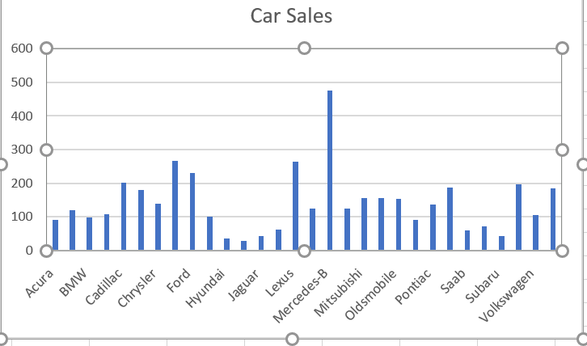
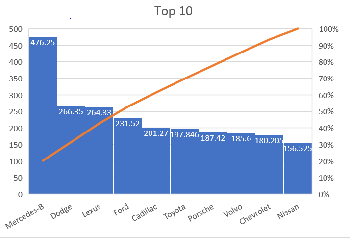

# Dhanusha-piping-map-reduce

[link to dataset](https://www.kaggle.com/gagandeep16/car-sales)

## About Data
This is the Car sales data set which include information about different cars . This data set is being taken from the Analytixlabs for the purpose of prediction
In this we have to see two things, first we have see which feature has more impact on car sales and carry out result of this
Secondly we have to train the classifier and to predict car sales and check the accuracy of the prediction..

## Data
I have processed data with 16 columns to data which shows different car's and  Sales.

## Chart1 Findings:
This chart shows the sales of various cars.

## Chart2 Findings
Among the 10 car's, Mercedes has the most sales and Nissan has least sales.

